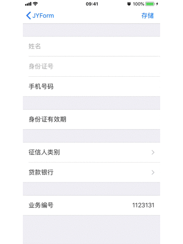
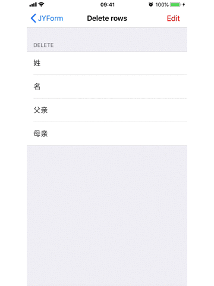

### JYForm

JYForm是一个iOS开源库，能够快速，灵活的搭建，修改表单。
		
### 目录

* auto-gen TOC:
{:toc}
	
### 如何创建表格

`JYForm`在创建时隐藏了复杂的实现，却可以依旧拥有强大，灵活的修改表单的能力。

我们使用三个类来定义一个表格:
- JYFormDescriptor
- JYFormSectionDescriptor
- JYFormRowDescriptor

一个表单即为一个`JYFormDescriptor`对象，一个`JYFormDescriptor`包含一个或者多个`JYFormSectionDescriptor`对象，一个`JYFormSectionDescriptor`对象包含一个或者多个`JYFormRowDescriptor`对象。你可以注意到form的结构(JYFormDescriptor --> JYFormSectionDescriptor --> JYFormRowDescriptor)类似于`UITableView`的结构(Table --> Sections --> Rows)。

让我们先看一个例子，看看如何使用JYForm创建一个表单：
	
	
```
- (void)viewDidLoad {
    [super viewDidLoad];
    
    JYFormDescriptor *formDescriptor = [JYFormDescriptor formDescriptor];
    JYFormSectionDescriptor *section = nil;
    JYFormRowDescriptor *row = nil;
    
    section = [JYFormSectionDescriptor formSectionWithTitle:nil];
    [formDescriptor addFormSection:section];
    
    row = [JYFormRowDescriptor formRowDescriptorWithTag:@"00" rowType:JYFormRowDescriptorTypeFloatLabeledTextField title:@"姓名"];
    [section addFormRow:row];
    row.required = YES;
    
    row = [JYFormRowDescriptor formRowDescriptorWithTag:@"01" rowType:JYFormRowDescriptorTypeFloatLabeledTextField title:@"身份证号"];
    [section addFormRow:row];

    row = [JYFormRowDescriptor formRowDescriptorWithTag:@"02" rowType:JYFormRowDescriptorTypeInteger title:@"手机号码"];
    [section addFormRow:row];
    row.required = YES;
    
    section = [JYFormSectionDescriptor formSectionWithTitle:nil];
    [formDescriptor addFormSection:section];
    
    row = [JYFormRowDescriptor formRowDescriptorWithTag:@"10" rowType:JYFormRowDescriptorTypeText title:@"身份证地址"];
    [section addFormRow:row];
    
    row = [JYFormRowDescriptor formRowDescriptorWithTag:@"11" rowType:JYFormRowDescriptorTypeDate title:@"身份证有效期"];
    [section addFormRow:row];
    
    section = [JYFormSectionDescriptor formSectionWithTitle:nil];
    [formDescriptor addFormSection:section];
    
    row = [JYFormRowDescriptor formRowDescriptorWithTag:@"20" rowType:JYFormRowDescriptorTypeSelectorPush title:@"征信人类别"];
    row.selectorOptions = [JYFormOptionsObject formOptionsObjectsWithValues:@[@1， @2， @3] displayTexts:@[@"主贷人"， @"主贷人配偶"， @"担保人"]];
    row.selectorTitle = @"征信人类别";
    [section addFormRow:row];
    
    row = [JYFormRowDescriptor formRowDescriptorWithTag:@"21" rowType:JYFormRowDescriptorTypeSelectorPush title:@"贷款银行"];
    row.selectorOptions = [JYFormOptionsObject formOptionsObjectsWithValues:@[@1， @2， @3] displayTexts:@[@"工行银行"， @"农业银行"， @"交通银行"]];
    row.selectorTitle = @"贷款银行";
    [section addFormRow:row];
    
    section = [JYFormSectionDescriptor formSectionWithTitle:nil];
    [formDescriptor addFormSection:section];
    
    row = [JYFormRowDescriptor formRowDescriptorWithTag:@"30" rowType:JYFormRowDescriptorTypeInfo title:@"业务编号"];
    row.value = @"1123131";
    [section addFormRow:row];
    
    
    JYForm *form = [[JYForm alloc] initWithFormDescriptor:formDescriptor autoLayoutSuperView:self。view];
    [form beginLoading];
    self。form = form;

}

```		

在上面的代码中，当我们定义完form的主体结构，然后添加到父视图之后之后，可以调用`-(void)beginLoading`来进行tableview的初始化操作。在后面如果我们想对form进行修改的话(删除添加行，删除添加节，修改行的内容)，可以通过直接修改`JYFormSectionDescriptor`、`JYFormRowDescriptor`的方式。这样的好处是你可以不必再花时间在`NSIndexPath`，`UITableViewDelegate`、`UITableViewDataSource`上了。





#### 使用AutoLayout添加

在上面那个例子中，在创建`JYForm`对象的时候我是这样写的:
 ```
 JYForm *form = [[JYForm alloc] initWithFormDescriptor:formDescriptor autoLayoutSuperView:self。view];
 ```
 
 这样子可以将JYForm直接添加到`self。view`中，并且自动使用NSLayout布局(JYForm与父视图在竖直与水平的间距均为0)，当设备横向或者竖向时都能保持完全铺满父视图。如果需要更复杂点的自动布局，你可以需要自己实现了。。
 
```

JYForm *form1 = [[JYForm alloc] initWithFormDescriptor:formDescriptor];
[self。view addSubview:form1];
    //自动布局代码。。。
```

#### 使用CGRect添加

你还可以使用CGRect对JYForm进行布局

```
JYForm *form = [[JYForm alloc] initWithFormDescriptor:formDescriptor frame:CGRectMake(0， 0， 375。， 667。)];
[self。view addSubview:form];
[form beginLoading];
```
这种方式比较简单，但有几个缺点:

- 就是设备横向与竖向时候，JYForm的显示可能会不一样。
- 键盘弹出时的动画可能会有点僵硬


### 行的种类

#### 文本输入行

##### JYFormRowDescriptorTypeText

`NSString *const JYFormRowDescriptorTypeText = @"text";`

这种样式下，`UITextField`的`autocapitalizationType`属性为`UITextAutocapitalizationTypeSentences`(每句的首字母大写)，`autocorrectionType`属性为`UITextAutocorrectionTypeDefault`，`keyboardType`属性为`UIKeyboardTypeDefault`


##### JYFormRowDescriptorTypeName

`NSString *const JYFormRowDescriptorTypeName = @"name";`

这种样式下，`UITextField`的`autocapitalizationType`属性为`UITextAutocapitalizationTypeWords`(每个词的首字母大写)，`autocorrectionType`属性为`UITextAutocorrectionTypeNo`，`keyboardType`属性为`UIKeyboardTypeDefault`


##### JYFormRowDescriptorTypeURL

`NSString *const JYFormRowDescriptorTypeURL = @"url";`

这种样式下，`UITextField`的`autocapitalizationType`属性为`UITextAutocapitalizationTypeNone`(无大写)，`autocorrectionType`属性为`UITextAutocorrectionTypeNo`，`keyboardType`属性为`UIKeyboardTypeURL`


##### JYFormRowDescriptorTypeEmail

`NSString *const JYFormRowDescriptorTypeEmail = @"email";`

这种样式下，`UITextField`的`autocapitalizationType`属性为`UITextAutocapitalizationTypeNone`(无大写)，`autocorrectionType`属性为`UITextAutocorrectionTypeNo`，`keyboardType`属性为`UIKeyboardTypeEmailAddress`


##### JYFormRowDescriptorTypePassword

`NSString *const JYFormRowDescriptorTypePassword = @"password";`

这种样式下，`UITextField`的`autocapitalizationType`属性为`UITextAutocapitalizationTypeNone`(无大写)，`autocorrectionType`属性为`UITextAutocorrectionTypeNo`，`keyboardType`属性为`UIKeyboardTypeASCIICapable`，并且`secureTextEntry`属性为`YES`


##### JYFormRowDescriptorTypeNumber

`NSString *const JYFormRowDescriptorTypeNumber = @"number";`

这种样式下，`UITextField`的`autocapitalizationType`属性为`UITextAutocapitalizationTypeNone`(无大写)，`autocorrectionType`属性为`UITextAutocorrectionTypeNo`，`keyboardType`属性为`UIKeyboardTypeNumbersAndPunctuation`


##### JYFormRowDescriptorTypeInteger

`NSString *const JYFormRowDescriptorTypeInteger = @"integer";`

这种样式下，`UITextField`的`autocapitalizationType`属性为`UITextAutocapitalizationTypeNone`(无大写)，`autocorrectionType`属性为`UITextAutocorrectionTypeNo`，`keyboardType`属性为`UIKeyboardTypeNumberPad`


##### JYFormRowDescriptorTypeDecimal

`NSString *const JYFormRowDescriptorTypeDecimal = @"decimal";`

这种样式下，`UITextField`的`autocapitalizationType`属性为`UITextAutocapitalizationTypeNone`(无大写)，`autocorrectionType`属性为`UITextAutocorrectionTypeNo`，`keyboardType`属性为`UIKeyboardTypeDecimalPad`


##### JYFormRowDescriptorTypePhone

`NSString *const JYFormRowDescriptorTypePhone = @"phone";`

这种样式下，`UITextField`的`autocapitalizationType`属性为`UITextAutocapitalizationTypeNone`(无大写)，`autocorrectionType`属性为`UITextAutocorrectionTypeNo`，`keyboardType`属性为`UIKeyboardTypeNumberPad`


##### JYFormRowDescriptorTypeTextView

`NSString *const JYFormRowDescriptorTypeTextView = @"textView";`

这种样式下，`UITextField`的`autocapitalizationType`属性为`UITextAutocapitalizationTypeSentences`(每句的首字母大写)，`autocorrectionType`属性为`UITextAutocorrectionTypeNo`，`keyboardType`属性为`UIKeyboardTypeDefault`


#### 选择行

选择行允许我们从某个选择列表中选择一行或者几行

`NSString *const JYFormRowDescriptorTypeSelectorPush = @"selectorPush";`
`NSString *const JYFormRowDescriptorTypeMultipleSelector = @"multipleSelector";`
`NSString *const JYFormRowDescriptorTypeSelectorActionSheet = @"selectorActionSheet";`
`NSString *const JYFormRowDescriptorTypeSelectorAlertView = @"selectorAlertView";`
`NSString *const JYFormRowDescriptorTypeSelectorPickerView = @"selectorPickerView";`


单个选择项必须为`JYFormOptionsObject`对象(JYFormRowDescriptorTypeSelectorPush，JYFormRowDescriptorTypeMultipleSelector可能除外)，`JYFormOptionsObject`有两个属性`formDisplaytext`(文本显示)，`formValue`(实际值)。你需要将你想要添加的一些选择项添加到`JYFormRowDescriptor`的`selectorOptions`属性。

JYForm遵循下列的先后顺序来显示您的选择项文本:

- 如果`JYFormRowDescriptor`的`valueTransformer`属性不为空，则会显示`valueTransformer`转换`JYFormOptionsObject`的`formDisplaytext`之后的文本。
- 直接显示`JYFormOptionsObject`的`formDisplaytext`文本

#### 日期，时间行

##### JYFormRowDescriptorTypeDate

`NSString *const JYFormRowDescriptorTypeDate = @"date";`


##### JYFormRowDescriptorTypeTime

`NSString *const JYFormRowDescriptorTypeTime = @"time";`


##### JYFormRowDescriptorTypeDateTime

`NSString *const JYFormRowDescriptorTypeDateTime = @"datetime";`


##### JYFormRowDescriptorTypeCountDownTimer

`NSString *const JYFormRowDescriptorTypeCountDownTimer = @"countDownTimer";`


##### JYFormRowDescriptorTypeDateInline

`NSString *const JYFormRowDescriptorTypeDateInline = @"dateInline";`


#### 布尔行

`NSString *const JYFormRowDescriptorTypeSwitch = @"switch";`


`NSString *const JYFormRowDescriptorTypeCheck = @"check";`


#### 其它行

##### Stepper

`NSString *const JYFormRowDescriptorTypeStepCounter = @"stepCounter";`

你可以这样设置它

```
[row.cellConfigAtConfigure setObject:@YES forKey:@"stepControl。wraps"];
[row.cellConfigAtConfigure setObject:@10 forKey:@"stepControl。stepValue"];
[row.cellConfigAtConfigure setObject:@10 forKey:@"stepControl。minimumValue"];
[row.cellConfigAtConfigure setObject:@100 forKey:@"stepControl。maximumValue"];
```


##### Slider

`NSString *const JYFormRowDescriptorTypeSlider = @"slider";`

你可以这样设置它:

```
[row.cellConfigAtConfigure setObject:@(100) forKey:@"slider。maximumValue"];
[row.cellConfigAtConfigure setObject:@(10) forKey:@"slider。minimumValue"];
[row.cellConfigAtConfigure setObject:@(4) forKey:@"steps"];

```


##### Info

`NSString *const JYFormRowDescriptorTypeInfo = @"info";`

有时候我们需要一些不可编辑的行来展示一些信息(例如版本信息)，JYForm提供了我们`JYFormRowDescriptorTypeInfo`的行类型来展示不可编辑的信息。


##### Button

NSString *const JYFormRowDescriptorTypeButton = @"button";


按钮行允许我们再选中行的时候执行一些操作，他按照下面的规则来响应事件

- 如果`JYFormRowDescriptor`的`action`的`rowBlock`不为空，则执行block
- 如果`JYFormRowDescriptor`的`action`的`viewControllerClass`不为空，则跳转到该视图控制器


### Section

#### 行的删除

如果在JYForm中需要删除行，那你需要这样子初始化`JYFormSectionDescriptor`对象

```
section = [JYFormSectionDescriptor formSectionWithTitle:@"Delete" sectionOptions:JYFormSectionOptionCanDelete];
    [formDescriptor addFormSection:section];
    
```

当`JYForm`的`tableView`的`editing`属性为YES是，样式如下


如果`tableView`的`editing`属性为NO，那么你可以通过左滑来删除行，效果如下




### 获取表单值

#### formValues

你可以通过获取到表单上每行的值通过调用`JYForm`的`- (NSDictionary *)formValues;`方法或者`JYFormDescriptor`的`- (NSDictionary *)formValues;`方法。

结果`NSDictionary`的创建规则如下

- 遍历每一行，如果这行的`tag`的不为空，则以改行的`tag`为key，该行的value(value为空时传[NSNull null])为value添加到字典中。
- 需要注意如果该行是选中选择行类型的话，那么该行的value为`JYFormOptionsObject`对象，或者`NSArray<JYFormOptionsObject *>`类型

#### httpParameters

当我们创建好表单之后，常常需要将表单各行的值通过请求发送给后台，在这个时候你可以试着调用`JYForm`的`- (NSDictionary *)httpParameters;`方法或者`JYFormDescriptor`的`- (NSDictionary *)httpParameters:(JYForm *)form`方法来获取`httpParameters`。

结果`NSDictionary`的创建规则如下

- 如果改行实现了代理`JYFormDescriptorCell`的方法`- (NSString *)formDescriptorHttpParameterName;`，则以该返回值为key，改行的值为value(value为空时传[NSNull null])添加到字典中，如果没有实现该方法且`tag`不为空，则以`tag`为key，行的值为value添加到字典中
- 如果改行的值为`JYFormOptionsObject`对象，则添加的是`JYFormOptionsObject`的`formValue`属性;如果该行的值为如果改行的值为`NSArray<JYFormOptionsObject *>`类型 ，则添加到字典的值为`NSArray<JYFormOptionsObject。formValue>`;如果该行的值为`NSString`，`NSNumber`，`NSDate`类型，则返回该值本身


### 如何自定义行呢

如果你想要创建自己的`UITableViewCell`的话，那么一定要继承`JYFormBaseCell`。`JYFormBaseCell`必须要实现`JYFormDescriptorCell`代理。

```
@protocol JYFormDescriptorCell <NSObject>

@required

/**
 初始化控件以及一些数据，在cell被创建时会被调用，只被调用一次
 */
- (void)configure;

/**
 更新cell的控件，能被多次调用
 */
- (void)update;

@optional

/**
 如果你没有指定JYFormRowDescriptor的height属性，并且这个方法被实现了，那么cell的高度为这个方法的返回值。

 @param rowDescriptor JYFormRowDescriptor的实例
 @return JYFormRowDescriptor对应的cell的高度
 */
+ (CGFloat)formDescriptorCellHeightForRowDescriptor:(JYFormRowDescriptor *)rowDescriptor;


/**
 返回一个bool值，指示cell能够成为第一响应者，默认返回NO

 @return 如果cell可以成为第一响应者的话返回YES，否则返回NO
 */
- (BOOL)formDescriptorCellCanBecomeFirstResponder;


/**
 让当前的cell成为第一响应者

 @return 如果cell是第一响应者了返回YES，否则返回NO
 */
- (BOOL)formDescriptorCellBecomeFirstResponder;


/**
 当前的cell被选中了

 @param form cell被添加到的JYForm的实例
 */
- (void)formDescriptorCellDidSelectedWithForm:(JYForm *)form;


/**
 为该cell设置一个HttpParameterName，那么当调用JYFormDescriptor的实例方法-(void)httpParameters时，则会将该行，以方法返回值为key，值为value添加到结果字典中

 @return 为该cell设置一个HttpParameterName，不能为空
 */
- (NSString *)formDescriptorHttpParameterName;


/**
 当cell成为第一响应者时被调用，可以通过该方法改变cell的样式
 */
-(void)highlight;


/**
 当cell退出第一响应者时被调用
 */
-(void)unhighlight;

@end

```

当你创建好了一个新类`JYFormTestCell`，那么你在实现完代理方法之后，在`@implementation`后面的将类添加到JYForm的`cellClassesForRowDescriptorTypes`中，代码如下

```
+ (void)load
{
    [JYForm。cellClassesForRowDescriptorTypes setObject:[JYFormTestCell class] forKey:@"Test"];
}

```

添加完成之后，你可以直接在JYForm中直接添加这种类型的行`JYFormRowDescriptor *row = [JYFormRowDescriptor formRowDescriptorWithTag:@"test" rowType:@"Test"]`


### 如何在运行中改变表格

对`JYFormDescriptor`做的修改都会映射在JYForm中的'tableView'上，例如你对`JYFormSectionDescriptor`和`JYFormRowDescriptor`进行添加和删除，会直接表现在section以及row的添加或者删除。

也就是说，在JYForm中，我们再也不用使用`NSIndexPath`进行`UITableViewCell`的添加和删除。在JYForm中，每个`JYFormRowDescriptor`都有`tag`属性，我们可以通过`JYFormDescriptor`查找`tag`的方式来找到`JYFormRowDescriptor`，通过`tag`管理`JYFormRowDescriptor`显然会容易的多，类似于JS。因此，每个`JYFormRowDescriptor`的`tag`必须是唯一的。

通常来说，直接修改UITableView的样式是不被允许的，你可以通过修改`JYFormDescriptor`，`JYFormSectionDescriptor`，`JYFormRowDescriptor`来修改`UITableView`。


#### 隐藏row或者section

`JYFormDescriptor`和`JYFormSectionDescriptor`均有`hidden`属性，你可以将其设置为YES，来达到隐藏的目的。

#### 禁用

`JYFormDescriptor`和`JYFormSectionDescriptor`均有`disable`属性，你可以将其设置为YES，来达到隐藏的目的。禁用时，row会处于不可编辑状态，只能显示信息，不能响应事件。


### 让row或者section是否可见依赖于其他row的值


JYForm允许你定义两个row的依赖关系，当一行的值发生改变时另一行产生响应的变化，代码如下:

```
- (void)viewDidLoad {
    [super viewDidLoad];
    
    JYFormDescriptor *formDescriptor = [JYFormDescriptor formDescriptor];
    JYFormSectionDescriptor *section = nil;
    JYFormRowDescriptor *row = nil;
    
    
    //第一段
    section = [JYFormSectionDescriptor formSectionWithTitle:@"第一行"];
    [formDescriptor addFormSection:section];
    
    row = [JYFormRowDescriptor formRowDescriptorWithTag:@"00" rowType:JYFormRowDescriptorTypeSwitch title:@"显示下一行"];
    row.onChangeBlock = ^(id oldValue， id newValue， JYFormRowDescriptor *rowDescriptor) {
        JYFormRowDescriptor *nextRow = [formDescriptor formRowWithTag:@"01"];
        if ([newValue boolValue]) {
            nextrow.hidden = NO;
        } else {
            nextrow.hidden = YES;
        }
    };
    [section addFormRow:row];
    
    row = [JYFormRowDescriptor formRowDescriptorWithTag:@"01" rowType:JYFormRowDescriptorTypeSwitch title:@"显示下一节"];
    row.onChangeBlock = ^(id oldValue， id newValue， JYFormRowDescriptor *rowDescriptor) {
        if ([newValue boolValue]) {
            self。nextSection。hidden = NO;
        } else {
            self。nextSection。hidden = YES;
        }
    };
    [section addFormRow:row];
    row.hidden = YES;
    
    //第二段
    section = [JYFormSectionDescriptor formSectionWithTitle:@"依赖的section"];
    [formDescriptor addFormSection:section];
    section。hidden = YES;
    self。nextSection = section;
    
    row = [JYFormRowDescriptor formRowDescriptorWithTag:@"10" rowType:JYFormRowDescriptorTypeName];
    [row.cellConfigAtConfigure setObject:@"这是第二节" forKey:@"textField。placeholder"];
    [row.cellConfigAtConfigure setObject:@(NSTextAlignmentLeft) forKey:@"textField。textAlignment"];
    [section addFormRow:row];
    
    JYForm *form = [[JYForm alloc] initWithFormDescriptor:formDescriptor autoLayoutSuperView:self。view];
    [form beginLoading];
    self。form = form;
    // Do any additional setup after loading the view。
}

```


### 验证

JYForm提供验证功能，验证该行的值是否符合我们设定的条件。

每一个`JYFormRowDescriptor`都可以有一个列表的验证器。通过下面的三个方法，我们可以添加，或者删除验证器，或者对该行进行验证。

```
- (void)addValidator:(nonnull id<JYFormValidatorProtocol>)validator;
- (void)removeValidator:(nonnull id<JYFormValidatorProtocol>)validator;
- (nullable JYFormValidationObject *)doValidation;
```

当`JYFormRowDescriptor`进行了验证`doValidation`，如果结果不通过，会返回一个`JYFormValidationObject`实例，该对象里面有错误信息，以及所关联的`JYFormRowDescriptor`实例
。

我们可以创建自己的验证器，只需要实现`JYFormValidatorProtocol`代理。

```
@protocol JYFormValidatorProtocol <NSObject>

@required
- (JYFormValidationObject *)isValid:(JYFormRowDescriptor *)row;
@end
```

`JYFormRegexValidator`是JYForm创建的一个验证器，通过该类，你可以学习到一个验证器该如何工作。

当`JYFormRowDescriptor`的`required`属性为YES是，那么如果改行值为空的话也是通过不了验证的。

你可以通过`JYform`的`- (NSArray *)formValidationErrors;`方法所有验证不通过的行的错误信息。


### 对Rows进行额外的配置

`JYFormRowDescriptor`允许我们对`UITableViewCell`进行一般的配置，例如`rowType`，`value`，改行是否`required`，`hidden`，`disabled`等

当然，我们还可以使用KVC的方式对`UITableViewCell`的其他属性进行设置。`JYFormRowDescriptor`提供了四个配置字典供用户在不同的地方，时间段对`UITableViewCell`进行配置

```

///|< 配置cell，当JYForm调用update方法后使用
@property (nonnull， nonatomic， strong， readonly) NSMutableDictionary *cellConfigAfterUpdate;
///|< 配置cell，在JYFormOptionsViewController中的cellForRowAtIndexPath方法中被使用
@property (nonnull， nonatomic， strong， readonly) NSMutableDictionary *cellConfigForSelector;
///|< 配置cell，当JYForm调用update方法后，且disable属性为Yes时被使用
@property (nonnull， nonatomic， strong， readonly) NSMutableDictionary *cellConfigIfDisabled;
///|< 配置cell，当cell调用config之后，update方法之前调用
@property (nonnull， nonatomic， strong， readonly) NSMutableDictionary *cellConfigAtConfigure;

```

你可以像下面这样进行配置:

```
row = [JYFormRowDescriptor formRowDescriptorWithTag:@"name" rowType:JYFormRowDescriptorTypeText];
[row.cellConfigAtConfigure setObject:@"姓名" forKey:@"textField。placeholder"];
[row.cellConfigAtConfigure setObject:@(NSTextAlignmentLeft) forKey:@"textField。textAlignment"];
[row.cellConfigAtConfigure setObject:[UIColor redColor] forKey:@"textField。placeholderLabel。textColor"];
[section addFormRow:row];
```

### 更多例子请看Demo！

### FAQ

#### 如何给section自定义 header/footer

你也可以通过设置`JYFormSectionDescriptor`的`headerHieght`和`headerView`或者`footerHieght`和`footerView`属性来自定义header/footer

#### 如何给row设置value

你可以设置row的属性`value`

```
@property (nullable， nonatomic， strong) id value;
```
你可以发现这个属性的类型是`id`，所以你设置value时需要注意值的类型。例如，`JYFormRowDescriptorTypeDate`的类型为`NSDate`，`JYFormRowDescriptorTypeText`的类型为`NSString`。当设置完成之后，如果你需要刷新row的UI，你可以调用`JYForm`的方法`- (void)reloadFormRow:(JYFormRowDescriptor *)formRow;
`

#### 如何给选择行添加选项

JYForm有若干的选择行类型，大部分的类型都必须要先知道选项(如果设置了`action`的`viewControllerClass`属性，JYFormRowDescriptorTypeSelectorPush，JYFormRowDescriptorTypeMultipleSelector不需要)。你可以通过设置`JYFormRowDescriptor`的`selectorOptions`属性来设置选项。

#### 如何拿到表单的值

具体可以再看一眼上面的内容: 获取表单值

#### 如何改变UITextField的长度占比

你可以通过下面的代码这样设置

```
//设置范围0 ~ 1。0f
[row.cellConfigAtConfigure setObject:[NSNumber numberWithFloat:0。7] forKey:XLFormTextFieldLengthPercentage];

```

#### 设置UITextField可输入的最大字符数

```
[row.cellConfigAtConfigure setObject:@(20) forKey:@"textViewMaxNumberOfCharacters"];

```

#### 如何改变UITextField的returnKeyType

```
[row.cellConfigAtConfigure setObject:@(UIReturnKeyGo) forKey:@"nextReturnKeyType"];

```


#### 如何改变UITableViewCell的字体

可以在JYFormAppearanceConfig.h文件中，设置下面两个属性：

```
///|< cell主标题的字体
#define kJYForm_Cell_MainTextFont [UIFont preferredFontForTextStyle:UIFontTextStyleBody]
///|< cell副标题的字体
#define kJYForm_Cell_DetailTextFont [UIFont preferredFontForTextStyle:UIFontTextStyleBody]
```

#### 如何改变UITableViewCell的字体颜色

可以在JYFormAppearanceConfig.h文件中，设置下面几个属性：


```
///|< cell主标题颜色
#define kJYForm_Cell_MainTextColor UIColorHex(333333)
///|< cell被禁用时主标题颜色
#define kJYForm_Cell_MainDisableTextColor UIColorHex(a4a4a4)
///|< cell副标题的颜色
#define kJYForm_Cell_DetailTextColor UIColorHex(464646)
///|< cell被禁用时副标题的颜色
#define kJYForm_Cell_DetailDisableTextColor UIColorHex(c8c8c8)
```


#### 如何给日期行设置最大，最小日期

你可以通过下面的代码这样设置

```
[row.cellConfigAtConfigure setObject:[NSDate new] forKey:@"minimumDate"];
[row.cellConfigAtConfigure setObject:[NSDate dateWithTimeIntervalSinceNow:(60*60*24*3)] forKey:@"maximumDate"];
```

#### 如何使整个表单处于禁用状态

```
form。disable = YES;
[form。tableView reloadData];
```


#### 如何改变cell的高度

cell的高度优先级按照以下规则

- 指定JYFormRowDescriptor的`height`属性
- 实现`JYFormDescriptorCell`代理的方法`+ (CGFloat)formDescriptorCellHeightForRowDescriptor:(JYFormRowDescriptor *)rowDescriptor;`
- 前两部都没有的吗，则返回默认高度`static const CGFloat kCellestimatedRowHeight = 55。0;`

### 要求

- ARC
- iOS 8.0+


